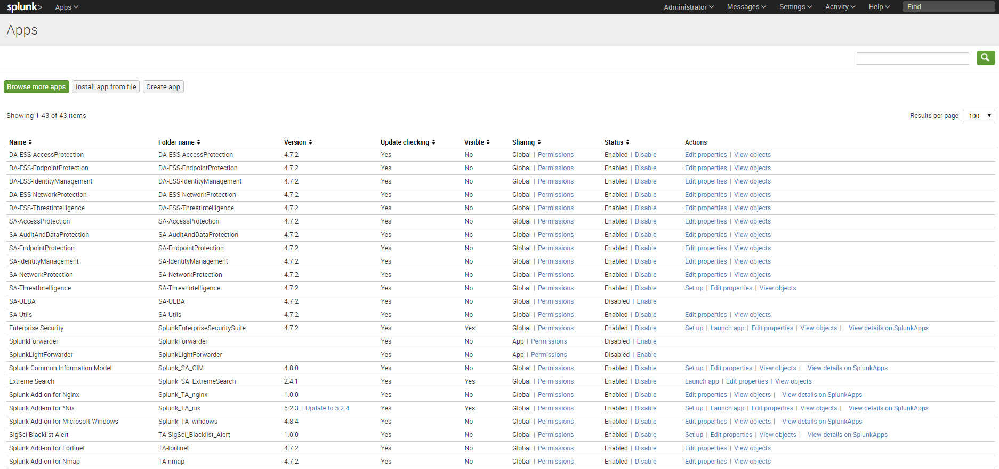
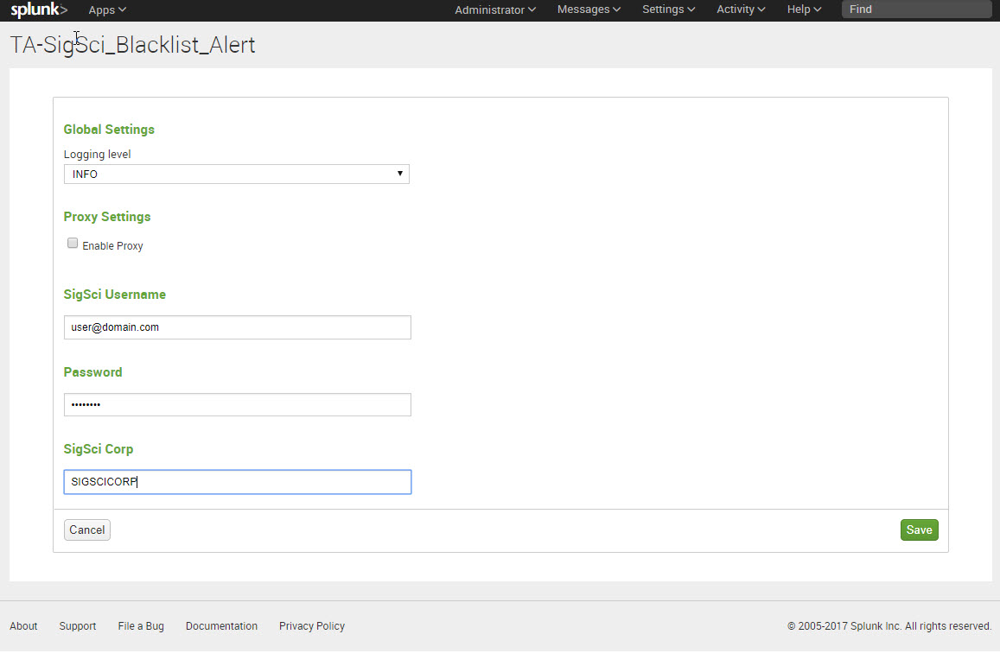
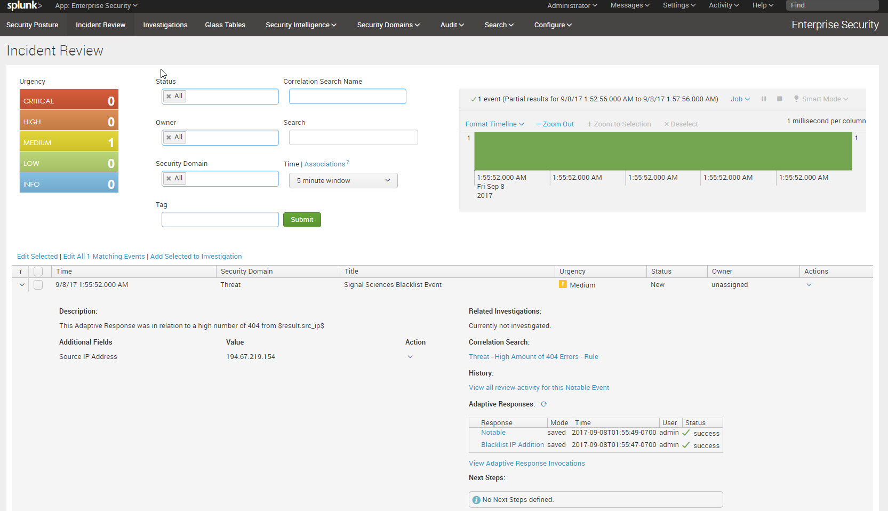
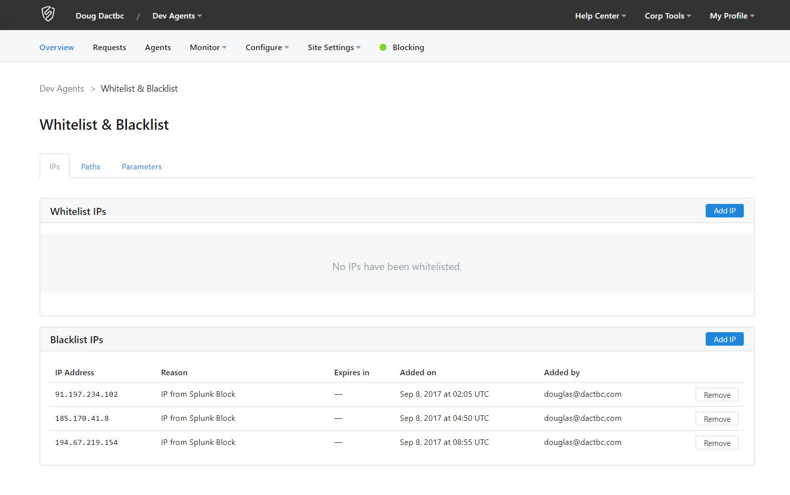

# Signal Sciences Blacklist Alert TA for Splunk

This Add-On for Splunk connects to the Signal Sciences API in order to create a blacklsit entry.
## Signal Sciences REST API Endpoints used

1. https://dashboard.signalsciences.net/api/v0/auth
2. https://dashboard.signalsciences.net/api/v0/corps/{{corp}}/sites/{{site}}/blacklist

## Indexes Created

No new indexes are created with this Add-On

## Configuration

Once the Splunk App has been installed you will need to configure the shared settings and then when using the alert in a Search.

1. Log into the Splunk Web Portal and go to the Apps -> Manage Apps section
2. Select Setup for the sigsci_TA_for_splunk app

    

3. Specify the Signal Sciences user (Email Address), Password, and your Signal Sciences corp name

    

## Using with a Correlation Search

With my configuration I have an NGINX Server that is using the NGINX Splunk Add-On to pull information into Splunk. Based on this App I am doing a search that will return IPs that have an amount of response codes over a threshold (i.e. 404). If you're using something else as the data source you will need to create your own search.

1. Go to the Enterprise Security App
2. Go to Configure -> Content Management
3. Click "Create New Content" in the top right
4. Select "Correlation Search"
5. Fill in the details for the search as follows:

    **Correlation Search**
    
    * **Search Name:** High Amount of 404 Errors 
    * **Description:** This Correlation Search will return IPs that have a high number of 404s based on the value coded into the search.
    * **Search:** `index=main sourcetype="nginx:plus:kv" status=404  | stats count values(http_method) as method values(uri_path) as uri_path values(uri_query) as uri_query  by src_ip | where count > 10` 
    
    _Note: This search might not work as is for you, it might need to be modified and replaced with one that works for your Splunk instance. This is just an example_
    
    **Time Range*
    
    * **Earliest Time:** -5m
    * **Latest Time:** now
    * **Cron Schedule:** */5 * * * *
    * **Scheduling:** Real-time
    * **Schedule Window** 0
    
    **Trigger Conditions**
    
    * **Trigger alert when:** "Number of Results", "is greater than", 0
    
    **Adaptive Response Actions**
    
    1. Click "Add New Response Action"
    2. Search for and select "Notable"
    
       * **Title:** Signal Sciences Blacklist Event
       * **Description:** This Adaptive Response was in relation to a high number of 404 from $result.src_ip$

    3. Click "Add New Response Action"
    4. Search for and select "Blacklist IP Addition"
    
        * **Site Name:** SIGSCI_SITENAME
        * **Blacklist IP:** $result.src_ip$
    
    5. Click Save
    
  **Viewing Results**
  
  1. Go to App -> Enterprise Security
  2. Go to Incident Review
  3. Look for Incidents with the title of "SigSci Blacklist Event"
      
      
      
  4. As long as the Incident Shows up you can now look in the Signal Sciences Dashboard for the Blacklisted IP.
  
      
      
That's it, you can now auto create entries.
  
  
